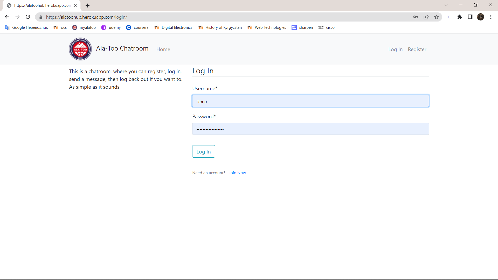

# Chatroom Django Web App
Deployed at https://alatoohub.herokuapp.com/

## About The Project
A simple chatroom, where you can register as a user, log into account, send messages and log back out whenever you want.

### Home Page

### Log In Page

### Sign Up Page

### Log Out Page

## Built With
* [Django](https://www.djangoproject.com/)
* [PostgreSQL](https://www.postgresql.org/)
* [Bootstrap4](https://getbootstrap.com/)

(<a href="#top">back to top</a>)

## Requirements Checklist

✅ Deploy online
https://alatoohub.herokuapp.com/

✅ Github

✅ Main Page

✅ PostgreSQL Database

(<a href="#top">back to top</a>)

