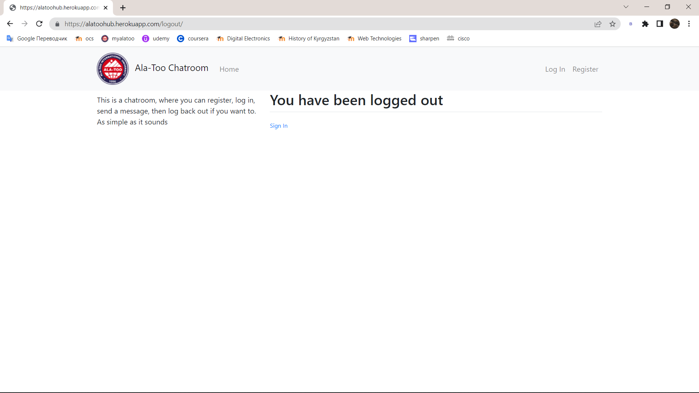

# Chatroom Django Web App
Deployed at https://alatoohub.herokuapp.com/

## Requirements Checklist

✅ Deploy online
- link to a web app

✅ Github
- readme description of project
- link to deploy
- database schema <a href="#erd">(ERD image)</a>
- <a href="#screenshots">screenshots</a>

✅ Main Page
- Short description
- University or Faculty logo
- List data from one table

✅ PostgreSQL Database

## About The Project
A simple chatroom, where you can register as a user, log into account, send messages and log back out whenever you want.

### Home Page

### Log In Page

### Sign Up Page

### Log Out Page

(<a href="#top">back to top</a>)

### ERD
The user table on the right is the default table that is maintained by Django itself.
My message table only contains id, username, content and timestamp of the message.

## Built With
* [Django](https://www.djangoproject.com/)
* [PostgreSQL](https://www.postgresql.org/)
* [Bootstrap4](https://getbootstrap.com/)

(<a href="#top">back to top</a>)

